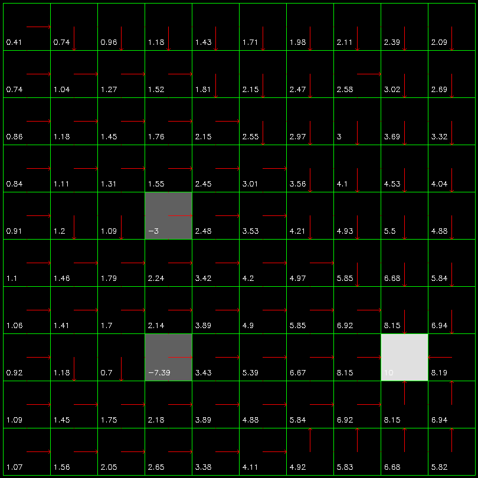

# Turtle-Sim

## Problem Statement

You will be given a file containing a matrix of `0’s` and `1’s`. `0’s` represent free path and `1’s` represent obstacles. In a ROS node, first of all move the turtle sim to the top left corner of the window. Then you have to map the matrix for the turtlesim window  and traverse the window avoiding the obstacles, to finally reach the opposite corner of the window.

Example Matrix:

```
0 0 1 0 0 0 0 0 1 1 0 0 0
0 0 1 0 0 0 0 0 1 1 0 0 0
0 0 1 0 0 1 0 0 1 1 0 0 0
0 0 0 0 0 1 0 0 0 0 0 0 0
0 0 0 0 0 1 0 0 0 0 0 0 0
```

## Dependencies

- OpenCV

## Samples 

**[WIP]**

Currently `value iteration` is implemented.

- Agent can take four actions i.e, move `up`, `right`, `left` or `down`. Once the agent takes an action `a`, it has a `0.7` probability of ending up in the state where the action leads to and a `0.1` probability of ending up in any other three adjacent states. By bumping into the walls, the agent recieves an immediate reward of `-1` and a reward of `zero` for all other transitions.

- Values at the lower bottom of each grid display `v(s)` and the arrows from each grid show the greedy policy.

- Obstacles are at `(4, 3)` and `(7, 3)` with negative reward of `-5` and `-10` respectively. Target is at `(7, 8)`

- Agent gets a reward of `-5` or `-10` once the agent leaves these states. Once the agent reaches the target, it doesn't move anywhere and hence constant `v(s)` for the target state.

- Initial random policy:


- Optimal policy for the given environment:


